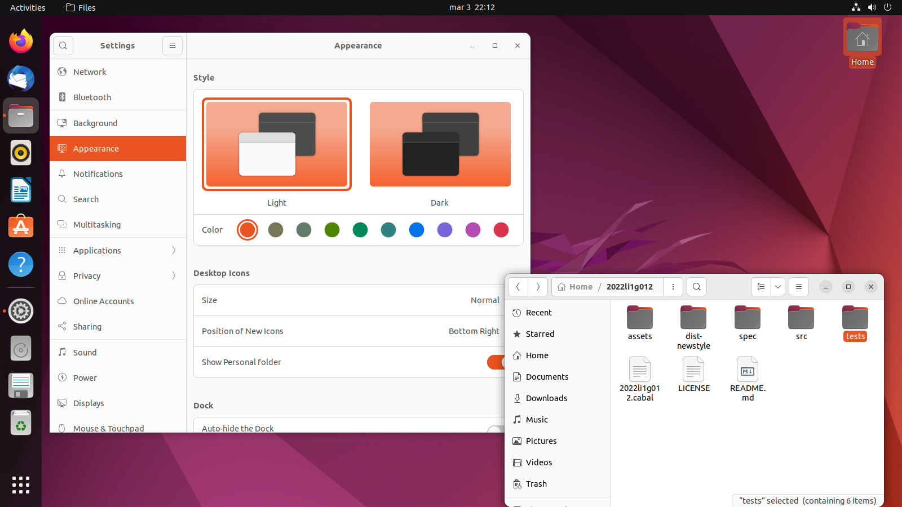
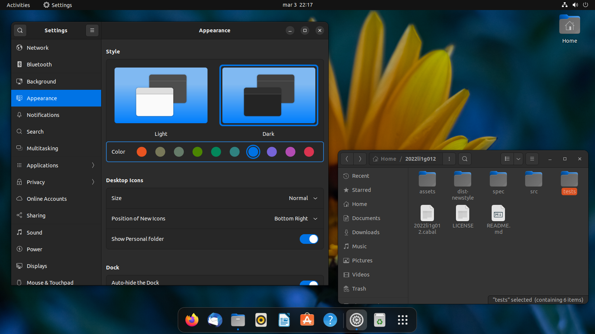
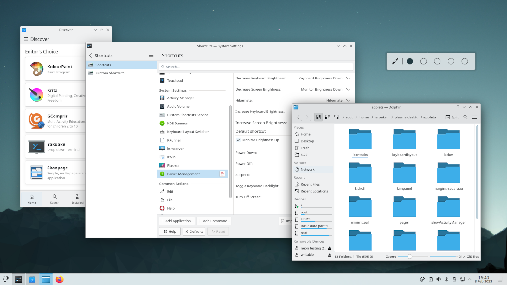
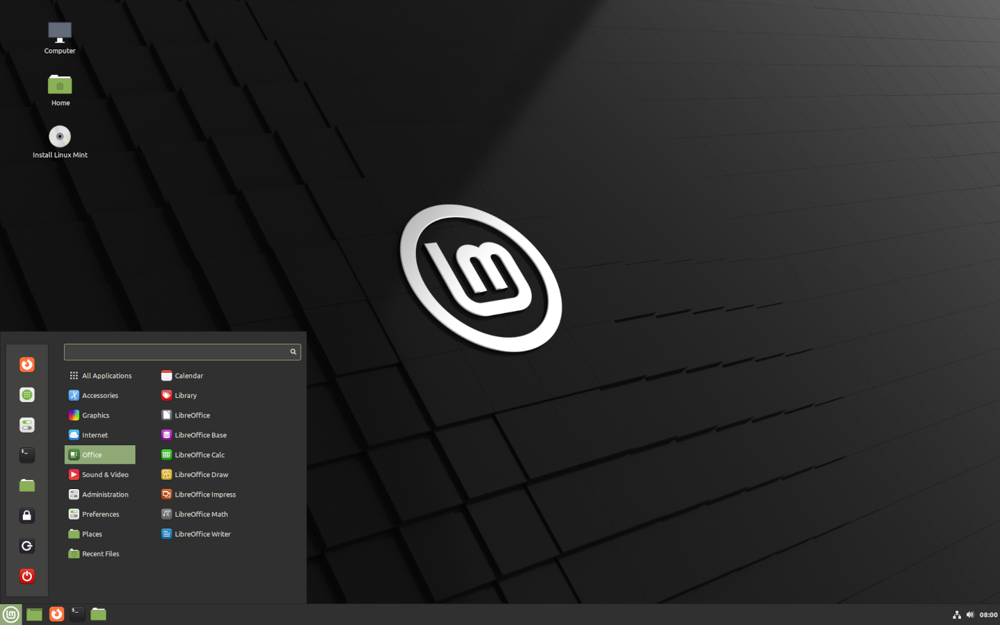

# Choosing a distro

##### Did you choose Ubuntu?

Did you read the previous article and decided to go with an Ubuntu-based
distribution? Great, you can **move on to the next article!** But don't forget
that, if you don't like your experience with it, you can always come back here
to choose something else.

## Factors to consider

To be able to pick a Linux distribution, you need to know how it differs from
others. Though a lot of little things can change between distros, we'll focus
on the main ones, the ones that will make your experience differ the most.

### Desktop environments

A desktop environment (**DE** for short) is a set of basic graphical
applications (terminal, file manager, image viewer, ...) and other on-screen
elements that you interact with (like the taskbar on Windows, or the Dock on
macOS).

Though **you can install DEs** other than your distro's default, the out of the
box experience is usually better. For example, you won't end up with two
different applications of each kind, one for every desktop environment you
install.

Here are some screenshots of common desktop environments:

##### GNOME

The first image is the default look of GNOME on [Ubuntu](https://ubuntu.com/).
The second one is the result of very few settings changes.

**Linux desktops are usually more customizable** than Windows or Mac, and GNOME
is somewhat criticized for lacking customization options! Now imagine the
possibilities you can have with other DE's! So, keep in mind that the
screenshots shown here may not be representative of the looks of a DE, as you
can tweak the settings to match your personal taste.

##### KDE Plasma

If you are looking for an Ubuntu-based distro with KDE out of the box, try
[Kubuntu](https://kubuntu.org/).

##### Cinnamon

If you are looking for an Ubuntu-based distro with Cinnamon out of the box, try
[Linux Mint](https://linuxmint.com/). This distro also provides other desktop
environment options; make sure you choose the right one.

##### Other recommendations

Do you come from a Windows / Mac background and don't want your workflow to
change much? Here are some suggestions:

* **Windows**: KDE, Cinnamon
* **Mac**: Pantheon ([elementary OS](https://elementary.io/))

Nevertheless, please try out different DEs (such as GNOME). You can't tell if
you like them or not if you don't try them out.

Do you have an **older computer** (< 4GB RAM)? A lightweight DE like XFCE
(found in [Xubuntu](https://xubuntu.org)) or LXQt (found in
[Lubuntu](https://lubuntu.me)) may be best for you.

##### Comparisons

I could keep writing all day, telling you that desktops X and Y are similar,
but while X is prettier than Y, Y is more customizable than X (by the way, the
solutions to the equation are X = Cinnamon, Y = KDE). Though, I won't keep
writing, because you should **test them out** and see if they are what **YOU**
are looking for. You can read the next article to know how you can test these
out before committing to one.

### Package managers

<!-- TODO - link package manager article -->

We recommend reading the full package management article in order to understand
what kind of software release cycle is best for you.

### Support & Community

If you have an issue with your operating system and need to fix it, you'll find
**better online search results** and more knowledgeable people to help you if
your **distro is popular**. Many **tutorials** are developed with common
distros in mind, and though you can adapt them to your distro, that's no easy
job for a beginner.

## Conclusion

In summary, to choose a distribution of your liking, follow these steps:

1. Try out desktop environments and pick the one you like the most;
2. Decide if rolling-release distros are right for you;
3. Don't choose an obscure distro unless you *really* know what you're doing;
4. Choose a distro based on your choices;
5. Change opinions and go back to step 1 (-\_-)

